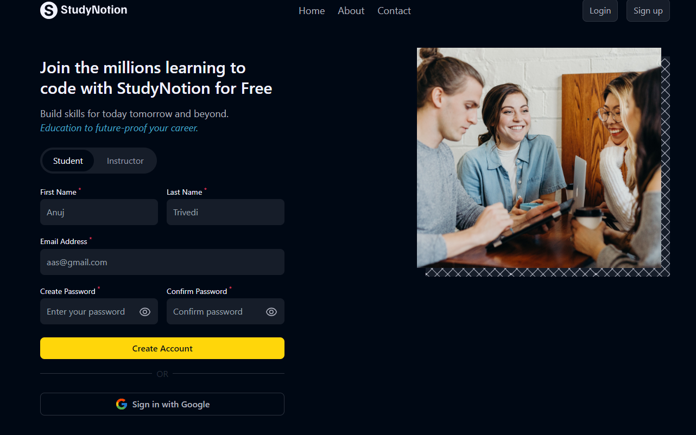
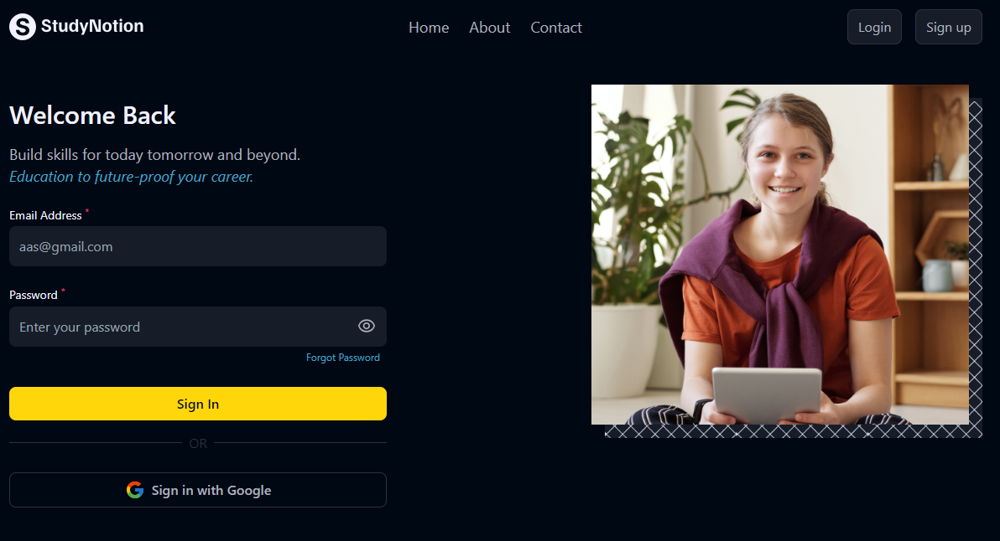

# 🚀 Welcome to My React App!

Hey there, fellow code explorer! 👋 Get ready to embark on an exciting journey through my React application. But before you dive into the code, let's chat about what makes this app so awesome! 🌟

## What's this App All About?

Picture this: 📸 You're on a quest to create the most epic web application the world has ever seen. You've got the front end all set up with React. You know, the stuff that users actually see and interact with.

But here's the twist! 🌀 While the front end dazzles users, the real magic (backend development) is brewing behind the scenes. Think of it as the secret sauce that's still simmering. 🍔👩‍🍳

### Features 🌈

- **User Authentication**: Our sign-up and log-in features are taking a siesta right now, but don't worry, we'll wake them up soon! Our code wranglers are busy preparing the coffee. ☕️💤

- **Responsive Design**: This app is cooler than a chameleon. It adapts to screens of all sizes. Whether you're on a colossal desktop or a teensy-weensy mobile, we've got you covered! 📱

- **Protected Routes**: Some routes are super exclusive, like VIP lounges in a fancy club. Only authenticated users get access! 🕺💃




Remember, this is just a sneak peek, and there's more tech wizardry coming your way! Stay tuned for updates. 🚀

## Technologies That Power the Magic ✨

- **React**: We're rocking the show with React, the rockstar of JavaScript libraries for building slick user interfaces.

- **React Router**: It's like GPS for your app, guiding users through different pages without getting lost in the wilderness.

- **CSS**: We've sprinkled some pixel-perfect, eye-candy CSS styles. It's all about making the app look fly!

## How to Run This Marvel

Ready to join the fun? Here's how to get started:

1. Clone this repository to your trusty local machine using the command below. It's like inviting a friend over for a coding party. 🎉

   ```bash
   git clone https://github.com/yourawesomeusername/my-react-app.git
   ```

2. Dive into the app's directory:

   ```bash
   cd my-react-app
   ```

3. Fire up the app by running this magic spell (I mean, command):

   ```bash
   npm start
   ```

4. Open your web browser and head to [http://localhost:3000](http://localhost:3000). The app should be waiting for you with open arms! 🤗

## Future Magic in the Works 🌟

Keep an eye out! While the front end is stealing the spotlight right now, our wizards in the backend department are brewing up something spectacular! 💫 Stay tuned for more updates, more features, and more awesomeness.

## Let's Connect 🤝

Got ideas, feedback, or just want to chat about the latest tech trends? Feel free to reach out. We're always here to geek out with fellow tech enthusiasts! 😎🚀

Happy Coding! 💻✨
